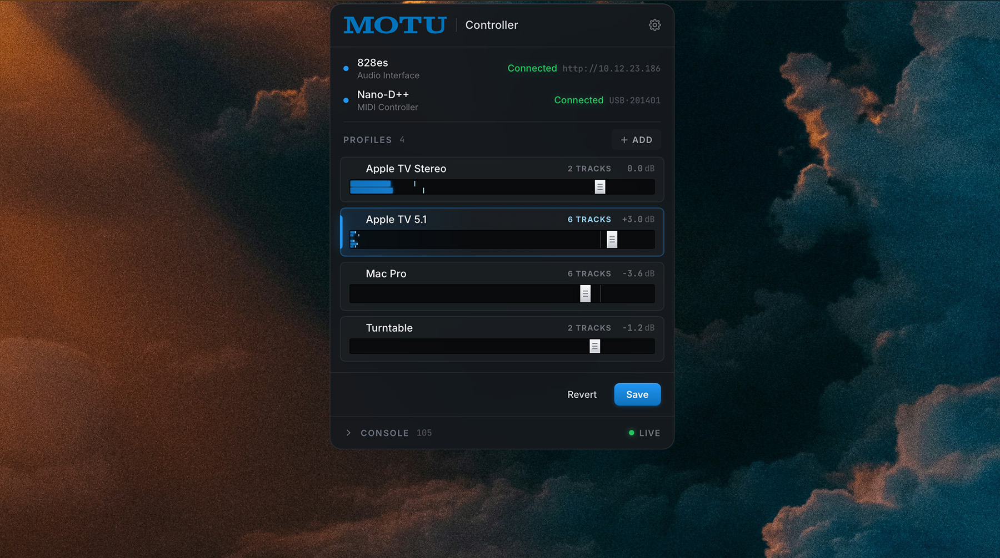

<h2 align="center">MOTU Controller</h2>

<p align="center">
A macOS menu bar controller for a MOTU 828es audio interface, designed to work with a Nano-D++ MIDI controller running compatible firmware.
</p>

<p align="center">
The app lets the Nano-D++ act as a hardware volume/profile controller for MOTU mix channels. It can create profiles from MOTU tracks, control mono/stereo/multichannel outputs, show live level meters, and sync the active profile and fader position between the app, the MOTU, and the device.
</p>
<div align="center">


</div>
<div align="center">
  
</div>

## Features

- **Lightweight App**: Menu bar app with a compact popover UI.
- **Connects to a MOTU 828es**: Connects over the MOTU HTTP datastore API.
- **Connects to a Nano-D++**: Connects over USB serial.
- **Single and Multi-track**: Reads labeled MOTU tracks and builds profiles from one or more channels with multichannel profiles and track-count labels.
- **Custom Profiles**: Rename, delete, and reorder local profiles.
- **From Nano-D++ to Motu**: Sends Nano-D++ knob changes to MOTU faders.
- **Sends changes to the Nano-D++**: Sends MOTU fader/profile state back to the Nano-D++.
- **Live canvas meters**: Configurable refresh rate: 30 Hz, 50 Hz, or 60 Hz.

## Requirements

- macOS 10.13+
    - Should work on both Intel and Apple Silicon Macs.
- A MOTU 828es reachable on the local network
    - May work with other MOTU devices, but not tested.
- A Nano-D++ connected over USB serial.
- Nano-D++ firmware that speaks the expected newline-delimited JSON protocol
    - [Nano-D++ Custom Firmware](https://github.com/chrisjameschamp/NanoD_RatchetH1)
- For development: Node.js/npm, Rust, and the macOS toolchain required by Tauri.

## Local Config

Runtime settings are stored locally on the Mac:

```text
~/Library/Application Support/MOTU Controller/config.json
```

The app starts with no MOTU IP and no profiles. Profiles and settings are created locally and saved there. The source tree intentionally does not include personal MOTU IP addresses or studio profile data.

## Development

Install dependencies:

```sh
npm install
```

Run a development build:

```sh
npm run tauri:dev
```

Build the app:

```sh
npm run tauri:build
```

The built macOS app is written to:

```text
src-tauri/target/release/bundle/macos/MOTU Controller.app
```

## Project Layout

```text
src/                 TypeScript UI and meter rendering
src-tauri/src/       Rust backend, serial I/O, MOTU HTTP calls, tray behavior
src-tauri/icons/     App and menu bar icons
public/              Static frontend assets
```

## Notes

This project is currently tailored to the MOTU 828es and the custom Nano-D++ firmware used with it. Other MOTU AVB devices may work if their datastore endpoints and meter responses match, but they have not been validated here.

## License

This project is licensed under the MIT License. See [LICENSE](LICENSE).

##

<div align="center">
  <a href="https://paypal.me/Champeau?country.x=US&locale.x=en_US"></a>
</div>
